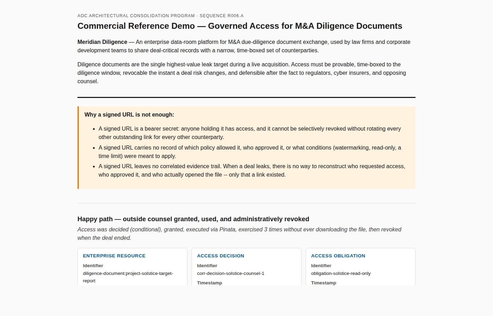

# R006.A — Commercial Reference Demo

- Status: **Implemented**
- Sequence: R006.A, AOC Architectural Consolidation Program
- Repository: `architects-of-change-protocol/aoc-enterprise` (AOC Enterprise)
- Branch: `claude/aoc-commercial-demo-g40xfx`
- Package: `@aoc-enterprise/commercial-demo` (`packages/commercial-demo`)
- Required input (read, not modified): `docs/architecture/ADR-ACCESS-LIFECYCLE.md`
  (R005.0), `packages/provider-adapter` (R005.A), `packages/provider-translation`
  (R005.B), `packages/pinata-adapter` (R005.C), `packages/provider-conformance-suite`
  (R005.D)

## Role of this document

This is the commercial narrative and reference documentation for the
executable demo in `packages/commercial-demo`. The objective of that demo
is **not** technical completeness — R005.0 through R005.D already froze a
complete, tested, provider-neutral architecture. The objective is
demonstrating **business value**: proving, with running code and one
realistic customer scenario, that the frozen lifecycle solves a real
problem better than the status quo (a signed URL), in a way a CTO, VP
Engineering, or Head of Product can understand in under five minutes.

No architecture is redesigned. No Enterprise contract, Provider Adapter,
Provider Translation model, or Provider Conformance Suite is modified.
`packages/commercial-demo` only imports and composes what R004–R005 already
shipped.

---

## Phase 1 — Business scenario

**Customer: Meridian Diligence** — an enterprise data-room platform used by
law firms and corporate development teams to run M&A due-diligence document
exchanges.

**Why Meridian needs Governed Access.** During a live acquisition, a target
company's most sensitive records — financial models, cap tables, IP
schedules, litigation exposure — must be shared with a narrow, constantly
changing set of counterparties (outside counsel, lenders, auditors) while
the deal is still confidential and can still fall through. Diligence
documents are the single highest-value leak target in the transaction.
Access must be:

- **provable** — Meridian must be able to show exactly who could see a
  document and when, not just that a link was generated;
- **time-boxed** — access should not outlive the diligence window;
- **instantly revocable** — the moment a deal risk changes (a leak
  suspected, a party withdraws), access must end, for one counterparty,
  without touching anyone else's access;
- **defensible after the fact** — to a regulator, a cyber insurer
  underwriting the deal, or opposing counsel in later litigation.

**Why an ordinary signed URL is insufficient.**

1. A signed URL is a bearer secret. Anyone holding it has access, and it
   cannot be selectively revoked without rotating every other outstanding
   link for every other counterparty.
2. A signed URL carries no record of which policy allowed it, who approved
   it, or what conditions (watermarking, read-only, a time limit) were
   supposed to apply.
3. A signed URL leaves no correlated evidence trail. When a deal leaks,
   there is no way to reconstruct who requested access, who approved it,
   and who actually opened the file — only that a link existed.

Governed Access answers all three by keeping "who decided what, and why"
entirely inside Enterprise-owned, immutable, provider-neutral records —
never inside the credential itself.

## Phase 2 — Reference asset

| Field | Value |
| --- | --- |
| Display name | `Project Solstice — Confidential M&A Target Report.pdf` |
| Classification | Confidential, board-restricted |
| Tags | `m&a`, `due-diligence`, `confidential`, `board-restricted` |
| Content type | `application/pdf` |
| Size | ~4.1 MB |
| Integrity | `sha256` digest, captured at registration |
| Provider | Pinata (IPFS) — `location.system: 'pinata'` |
| Provider identifiers | a CID (`location.uri`) and Pinata's own file id (`location.systemReference`) — never a credential |

Registered once as one `EnterpriseResourceEnvelope`
(`@aoc-enterprise/resource-envelope`, R004.D) and referenced, by identity
only, from every decision, grant, and usage event that follows.

## Phase 3 — Demo flow

```text
 Enterprise Resource                     EnterpriseResourceEnvelope
    │  Project Solstice target report registered; located at Pinata
    ▼
 Access Decision                         EnterpriseAccessDecision
    │  outside counsel requests access; policy evaluates to 'conditional'
    ▼
 Access Obligations                      EnterpriseAccessObligation[]
    │  read-only · time-limit · watermark-content (Pinata can't enforce
    │  the last one — surfaced by its own capability declaration)
    ▼
 Access Grant                            EnterpriseAccessGrant
    │  authorization issued: status 'active', expires in 24h
    ▼
 Provider Translation                    EnterpriseProviderTranslation
    │  grant → 'ProvideTemporaryAccess' instruction for provider 'pinata'
    ▼
 Pinata Adapter                          executePinataProviderTranslation
    │  translation executed against a mock PinataProviderClient
    ▼
 Provider Execution                      PinataProviderExecutionResult
    │  a temporary access link is issued (no credential ever recorded)
    ▼
 Usage Event                             EnterpriseUsageEvent[]
    │  AccessStarted, ContentViewed × 2 — never ContentDownloaded
    ▼
 Evidence Correlation                    EnterpriseEvidenceCorrelation
    │  decision + obligations + grant + usage + revocation, tied together
    ▼
 Grant Revocation                        EnterpriseGrantRevocation
       deal ends early; Meridian security revokes the grant administratively
```

Every step is observable: `packages/commercial-demo/src/run-demo.ts`
constructs a real instance of the corresponding contract at each stage, and
`__tests__/run-demo.test.ts` asserts each one independently valid against
its own package's `validate*` function.

## Phase 4 — Visualization

Every artifact renders as a business-readable card — **identifier,
timestamp, owner, relationship, purpose** — never a raw object dump (see
`src/narration.ts`, `src/render-console.ts`, `src/render-report.ts`).
Running `npm run demo` in `packages/commercial-demo` prints the full
transcript and writes a self-contained HTML report plus a Markdown report
under `demo-output/`.

Screenshot of the generated HTML report (`docs/commercial/screenshots/`):



Full report (all five scenarios and the audit reconstruction):
`docs/commercial/screenshots/commercial-demo-report-full.png`.

## Phase 5 — Business narrative per transition

| Transition | Business purpose (not implementation) |
| --- | --- |
| Resource → Access Request | A named counterparty asks for access to a specific, already-registered document. |
| Access Request → Access Decision | Turns "someone asked" into a provable, timestamped record of what was decided and why — before the document is ever touched. |
| Access Decision → Policy Obligations | Declares the conditions access is conditional on. Checking the provider's own capability declaration here surfaces a coverage gap (watermarking) *before* a grant is issued, not after a leak. |
| Decision + Obligations → Access Grant | The moment authorization becomes real — a record Meridian can point to, revoke, or let lapse, independent of whatever secret a provider eventually issues. |
| Access Grant → Provider Translation | Converts an Enterprise-owned authorization into an instruction one specific provider understands, without that provider ever seeing *why* the grant was issued. |
| Provider Translation → Provider Execution | The provider actually serves the access — the one step Meridian does not own, and deliberately does not need to, to keep its own audit trail complete. |
| Provider Execution → Usage Event | What actually happened, recorded independently of the provider. In this run, no `ContentDownloaded` event is ever recorded — direct evidence the read-only obligation held, not just a policy claim that it should. |
| Access Grant → Grant Revocation | Access ends the instant the business reason for it ends — one recorded fact, with no signed URL to rotate and no other counterparty affected. |
| All of the above → Evidence Correlation | The one artifact a compliance officer, cyber insurer, or opposing counsel is ever handed. Everything above is reachable from it alone. |

## Phase 6 — Failure demonstrations

Every failure is a canonical, provider-neutral response — never a raw
provider exception, HTTP status, or stack trace.

| Scenario | Canonical response |
| --- | --- |
| **Denied access** | `EnterpriseAccessDecision.outcome: 'deny'`. Nothing downstream (no obligation, grant, translation, or provider execution) is ever created. `EnterpriseEvidenceCorrelation.decisionRefs` is the only populated reference array. |
| **Expired grant** | The already-lapsed grant's `expiresAt` is compared against wall-clock time *before* any provider call is made; translation is refused with `EnterpriseProviderFailureReason: 'grant-expired'`, recorded as an `AccessExpired` usage event. |
| **Unsupported capability** | A `RegisterUsage` translation requires `SupportsUsageReporting`, which Pinata's own capability declaration does not include; `executePinataProviderTranslation` refuses it with `failureReason: 'capability-unsupported'`, recorded as an `AccessDenied` usage event — never silently ignored. |
| **Provider failure** | The mock Pinata client raises the same `PinataProviderClientError` a real network outage would; the adapter normalizes it to `failureReason: 'provider-unavailable'`, recorded as an `AccessFailed` usage event. The grant itself is untouched — the same grant can be retried once Pinata recovers. |

## Phase 7 — Audit reconstruction

Starting from nothing but the happy path's final
`EnterpriseEvidenceCorrelation` id, `LifecycleRecordStore.reconstructAccessHistory`
(`packages/commercial-demo/src/lifecycle-record-store.ts`) dereferences
every reference the correlation graph carries and answers:

- **Who requested** — the decision's `request.principalId` and `requestedAt`.
- **Who approved** — the grant's `issuerRef` and `issuedAt`.
- **When granted** — the grant's `issuedAt`/`expiresAt` window.
- **When used** — every usage event's `eventType` and `occurredAt`, in
  chronological order.
- **When revoked** — the revocation's `revokedAt`, `issuerRef`, and `reason`.

No field on any of these records was invented for this demo — every one is
a field the seven frozen contracts already carry. Reconstruction is pure
dereferencing, not a new capability.

## Phase 8 — Commercial story

**Problem.** M&A due-diligence platforms (and any enterprise data room —
healthcare record portals, financial reporting portals, supply-chain
documentation exchanges) share highly sensitive, time-sensitive documents
with narrow, shifting sets of external counterparties, and are expected to
prove, after the fact, exactly who could see what and why.

**Existing solution.** Signed/presigned URLs from the storage provider
directly. Fast to build, but a bearer secret with no policy record, no
selective revocation, and no evidence trail — exactly the gap Phase 1
describes.

**AOC solution.** A provider-neutral Governed Access lifecycle: every
access decision, obligation, grant, usage observation, and revocation is
its own immutable, independently auditable record, entirely separate from
whatever secret a provider issues underneath. Swapping the storage provider
(Pinata → S3 → Azure Blob → Google Drive → SharePoint) changes only the
Provider Translation/Execution step — nothing about how access is decided,
recorded, or audited.

**Business benefits.**
- A defensible, provable answer to "who could see this, and when" —
  independent of provider uptime.
- Access ends instantly and selectively, without rotating every other
  counterparty's credential.
- Policy gaps (an obligation no provider can enforce) are surfaced *before*
  a grant is issued, not discovered after an incident.

**Engineering benefits.**
- One lifecycle, seven frozen, compile-time-enforced-neutral contracts —
  no bespoke access-control schema per storage provider.
- A closed, testable failure vocabulary (`EnterpriseProviderFailureReason`)
  instead of ad hoc provider-specific error handling.
- A Provider Conformance Suite (R005.D) any future adapter — S3, Azure
  Blob, Google Drive, SharePoint — certifies against before it ships.

**Risk reduction.** No credential, signed URL, or provider SDK type can
ever appear inside a Decision, Obligation, Grant, Usage Event, or Evidence
Correlation — enforced at compile time in every one of the seven frozen
packages, not by convention.

**Time-to-market reduction.** A new storage provider is one new adapter
satisfying an already-frozen, already-tested contract — not a redesign of
how access is decided, granted, or audited.

## Phase 9 — Five-minute presentation script

*Audience: CTO, VP Engineering, Head of Product.*

**[0:00–0:45] Problem.** "Imagine you're Meridian Diligence, running an M&A
data room. You need to share a confidential target report with outside
counsel for exactly 24 hours, prove it was watermarked and read-only, and
be able to cut access off instantly if the deal falls through — without
touching anyone else's access. A signed URL can't do any of that: it's a
bearer secret with no policy record and no evidence trail."

**[0:45–1:30] Solution.** "AOC's Access Governance lifecycle separates
*deciding and recording* access from *executing* it. Every step — the
decision, the conditions attached to it, the grant, who used it, and any
revocation — is its own immutable, provider-neutral record. The provider
— Pinata here, S3 or SharePoint tomorrow — only ever sees a translated
instruction, never the policy reasoning behind it."

**[1:30–3:00] Architecture, live.** *(run `npm run demo`)* "Watch: outside
counsel requests access. Policy evaluates it — conditional, with three
obligations, one of which — watermarking — Pinata's own capability
declaration says it can't enforce. That gap is visible right now, before
any grant is issued. The grant is issued, translated, executed against
Pinata, and the report is viewed twice — never downloaded, because the
usage trail itself proves the read-only obligation held. Then the deal
ends early, and Meridian revokes the grant — one record, no credential
rotation for anyone else."

**[3:00–4:00] Failure paths.** "And here's what happens when things go
wrong: a denied requester gets a clean denial, on the record. A stale
grant is refused before it ever reaches a provider. An obligation the
provider can't satisfy is refused explicitly, never silently ignored. A
Pinata outage becomes a normalized failure category — never a raw
exception — and the grant itself stays valid for the next retry."

**[4:00–4:45] Business value.** "Every one of those outcomes is provable
independent of whether Pinata is even online — because none of the
governance facts live inside a provider credential. That's the difference
between 'we assume this policy held' and 'we can show you exactly what
happened, and when, six months from now.'"

**[4:45–5:00] Competitive advantage / future expansion.** "This same
lifecycle, unchanged, already covers S3, Azure Blob, Google Drive, and
SharePoint conceptually — swapping providers only changes one step. The
next adapter we build certifies against the same Provider Conformance
Suite this one does, before it ever ships."

## Phase 10 — Documentation

| Deliverable | Location |
| --- | --- |
| README (demo instructions, architecture validation) | `packages/commercial-demo/README.md` |
| Architecture diagram | Phase 3 above (mirrors `ADR-ACCESS-LIFECYCLE.md` Phase 3) |
| Business flow diagram | Phase 3 above, in business terms |
| Commercial flow diagram | Phase 8 above (problem → AOC solution) |
| Sequence diagram | Phase 3's flow plus Phase 9.1–9.5 of `ADR-ACCESS-LIFECYCLE.md`, which this demo instantiates concretely |
| Demo instructions | `npm run demo` from `packages/commercial-demo`, or `npm run demo:commercial` from the repository root |
| Screenshots | `docs/commercial/screenshots/commercial-demo-report-hero.png`, `commercial-demo-report-full.png` |

## Phase 11 — Validation

See the Pull Request description for the exact commands run
(`typecheck`, `build`, `test`, `lint`, `check:aoc-boundaries`,
`validate:publishability`, `check-duplicate-semantic-contracts`) and their
results.

---

**R006.A COMPLETE — COMMERCIAL REFERENCE DEMO IMPLEMENTED**
