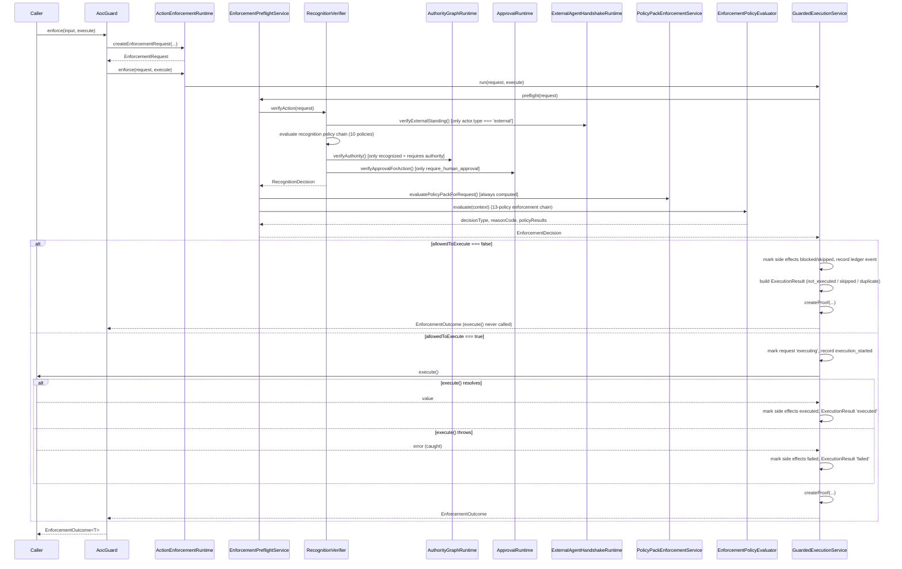

# AOC Kernel — Current Execution Model (Pre-Extraction)

This document reconstructs the **actual** execution semantics of `AocGuard.enforce()` as implemented today, before
any kernel extraction. Every claim below is anchored to a real file, function, type, or test in this repository at
the time of writing. It describes behavior, not intent — where behavior is ambiguous or surprising, that is called
out explicitly rather than smoothed over.

## 1. Entry point

```ts
class AocGuard {
  preflight(input: GuardPreflightInput): EnforcementDecision;
  async enforce<T>(input: GuardActionRequestInput, execute: () => Promise<T> | T): Promise<EnforcementOutcome<T>>;
  async verifyAndExecute<T>(input: GuardExecutionInput<T>): Promise<EnforcementOutcome<T>>;
}
```
`src/features/action-enforcement/sdk/aoc-guard.ts:79-121`

`verifyAndExecute` is `enforce` plus an `adapterType` tag used to default `target.type`; it does not add new
semantics. `ToolCallGuard`, `ApiHandlerGuard`, `WorkflowStepGuard`, `WebhookGuard`
(`src/features/action-enforcement/sdk/*.ts`) are all thin, adapter-specific wrappers over the same
`ActionEnforcementRuntime.preflight`/`enforce`.

## 2. Caller

Every production/test caller found in this repository constructs the runtime the same way: a concrete
`EnforcementRecognitionIntegration` bridges a fully-composed `AocRecognitionRuntime` (itself wired to Authority
Graph, Approval Runtime, and External Agent Handshake) into `ActionEnforcementRuntime`. The canonical example is
`buildDatasysEnforcementFixture()` in
`src/features/action-enforcement/fixtures/datasys-enforcement.fixture.ts:146-326`, reused by nearly every test in
`src/features/action-enforcement/tests/**`.

```ts
const enforcementCtx = createEnforcementRuntimeContext(NOW);                       // deterministic clock + ids
const recognitionIntegration = bridgeRecognitionRuntime(recognitionRuntime);       // structural adapter
const enforcementRuntime = createActionEnforcementRuntime(enforcementCtx, recognitionIntegration);
const aocGuard = createAocGuard(enforcementRuntime);
```

No Next.js, React, HTTP, or database dependency exists anywhere in this call path. `EnforcementRuntimeContext`
(`clock` + `ids`) is the only injected infrastructure, and production code can supply either the deterministic
manual clock/id generator (used everywhere in tests today) or real-time equivalents — nothing in the engine itself
hardcodes `Date.now()`/`crypto.randomUUID()`.

## 3. Inputs

`GuardActionRequestInput` (`sdk/aoc-guard.ts:10-44`): `actorId`, optional `principalActorId`, `trustDomainId`,
`action`, optional `capability`, `resourceScope`, optional target/adapter fields, optional risk/side-effect-type,
optional idempotency key, optional `mode` (`'preflight' | 'execute' | 'dry_run'`, default `'execute'` for `enforce`),
optional pre-existing approval/visa/ingress/handshake proof references, an optional `policyEvaluationInput` for the
Domain Policy Pack Runtime integration, and a free-form `metadata` bag. `AocGuard` builds an `EnforcementTarget` and
`ExecutionIntent` from this input (`buildTarget`/`buildIntent`, `sdk/aoc-guard.ts:53-73`) before calling
`runtime.createEnforcementRequest`.

`metadata` is significant, not decorative: the real recognition bridge (`bridgeRecognitionRuntime`, same fixture
file, lines 98-138) reads `metadata.passportId`, `metadata.capabilityTokenId`, and `metadata.evidence` off it,
because `RecognitionVerificationInput` deliberately does not carry Recognition Runtime's own primitive ids.

## 4. Validation

There is no explicit "reject malformed request" validation layer today. `EnforcementRequestService.createEnforcementRequest`
(`services/enforcement-request-service.ts:45`) always succeeds structurally (TypeScript's type system is the only
gate — a missing required field is a compile error, not a runtime `invalid_request` decision). `invalid_request` *is*
a defined `EnforcementDecisionType` (`domain/enforcement-decision.ts:12`), but nothing in the current policy chains
(`createDefaultEnforcementPolicyChain` or recognition-runtime's `createDefaultPolicyChain`) ever produces it — it is
reachable only if a caller of `EnforcementDecisionService.createDecision` sets `type: 'invalid_request'` directly.
**This is a real gap, not an oversight to paper over**: today, a request with (for example) an empty `actorId`
string flows all the way to `RecognizedActorPolicy`, which will simply fail to find a matching actor and produce a
normal `unrecognized_actor` recognition denial. The kernel's request-shape validation (`requestId`, `actor.id`,
`action.type` non-empty, etc.) is new behavior the kernel adds at its own boundary — it does not change what the
underlying engine does with a request that reaches it.

## 5. Recognition

`EnforcementPreflightService.preflight` (`services/enforcement-preflight-service.ts:41`) builds a
`RecognitionVerificationInput` from the `EnforcementRequest` and calls the injected
`EnforcementRecognitionIntegration.verifyAction(...)` unconditionally, every time, before anything else. In the real
wiring this reaches `RecognitionVerifier.verifyAction`
(`src/features/recognition-runtime/services/recognition-verifier.ts:38`), which:

1. Looks up `actor`, `trustDomain`, `passport`, `capabilityToken`, `principalActor` (all optional — absence is not
   fatal here, it is fatal later in the policy chain).
2. Runs `capabilityTokenService.checkCapabilityForAction` and `revocationEngine.checkRevocation`.
3. If `actor.type === 'external'` and an `ExternalAgentStandingIntegration` is configured, calls
   `externalAgentHandshake.verifyExternalStanding(...)` **before** the policy chain — specifically so that
   `RogueActorPolicy`'s blanket denial of `actor.type === 'external'` can be overridden by a valid handshake visa
   (recognition-verifier.ts:55-71 documents this ordering rationale inline).
4. Runs recognition-runtime's own fixed, first-failure-wins policy chain
   (`createDefaultPolicyChain`, `src/features/recognition-runtime/policies/index.ts:26-38`):
   `RecognizedActorPolicy -> RogueActorPolicy -> RevocationPolicy -> ValidPassportPolicy -> ValidCapabilityPolicy
   -> ProhibitedActionPolicy -> ScopePolicy -> DelegationPolicy -> EvidencePolicy -> ApprovalPolicy`.

`RecognitionDecisionType` values produced here include `allow`, `require_human_approval`, `require_more_evidence`,
and denial variants (`unrecognized_actor`, `rogue_actor`, `invalid_capability`, `revoked`, `expired`, `out_of_scope`,
`policy_violation`, `deny`, `invalid_passport`).

## 6. Authority resolution

Still inside `RecognitionVerifier.verifyAction` (`recognition-verifier.ts:102-120`): if an `AuthorityGraphIntegration`
is configured **and** the decision so far is one of `allow | require_human_approval | require_more_evidence` **and**
`requiresAuthorityChain(actor?.type, actorId, principalActorId)` is true (i.e. this is an agent acting for a
principal, or otherwise requires an authority chain), Authority Graph is consulted:
`authorityGraph.verifyAuthority({...})` (real implementation: `AuthorityGraphRuntime`,
`src/features/authority-graph/runtime/authority-graph-runtime.ts`). An invalid authority result **downgrades** the
decision type via `mapAuthorityDecisionType` and overwrites `reasonCode`/`reason` — it can only make the outcome
worse, never better. **Recognition passing never by itself proves authority**; a capability token can exist and be
unrevoked while the authority chain behind it is still invalid (see fixture test #9,
`tests/recognition-runtime-integration.test.ts:116-147`, "forged self-issued authority grant").

## 7. Policy evaluation (two distinct chains)

There are **two separate, sequential policy chains** in this call path, evaluated by different features for
different purposes:

- **Recognition-runtime's chain** (§5 above) decides the recognition/authority/approval verdict itself.
- **Action-enforcement's own chain** (`EnforcementPolicyEvaluator.evaluate`,
  `services/enforcement-policy-evaluator.ts:26`), run *after* recognition/authority/approval have already produced a
  result, decides whether the concrete *enforcement* request may execute given that verdict plus adapter/idempotency/
  policy-pack/timeout/side-effect/dry-run/post-execution-record concerns:
  `createDefaultEnforcementPolicyChain()` (`policies/index.ts:37-52`):
  `EmergencyDenyPolicy -> RecognitionRequiredPolicy -> AllowDecisionRequiredPolicy -> ApprovalPendingPolicy
  -> EvidenceRequiredPolicy -> ExternalStandingPolicy -> AdapterPermissionPolicy -> DomainPolicyPackPolicy
  -> IdempotencyPolicy -> ExecutionTimeoutPolicy -> SideEffectBoundaryPolicy -> DryRunPolicy
  -> PostExecutionRecordPolicy`.

Both chains are **first-failure-wins**: every policy that ran (passed or failed) is recorded in order in
`policyResults`; evaluation stops at the first `passed: false`. This is what makes the same normalized input
deterministic and reproducible (`enforcement-policy-evaluator.ts:12-18` states this explicitly; recognition-runtime's
`PolicyEvaluator` mirrors it).

## 8. Approval requirements

If, after Authority Graph, the decision type is `require_human_approval`, and an `ApprovalRuntimeIntegration` is
configured, `RecognitionVerifier` calls `approvalRuntime.verifyApprovalForAction(...)`
(real implementation: `ApprovalRuntime`, `src/features/approval-runtime/runtime/approval-runtime.ts`). This can:
upgrade the decision to `allow` (given a valid, sufficient approval proof), hard-block to `policy_violation`
(`isHardBlockingApprovalResult`), or leave it pending with a more specific reason
(`approval_missing`/`approval_expired`/`approval_insufficient_evidence`/`approval_quorum_not_met`). Approval Runtime
never runs for, and never overrides, an unrelated denial or an `allow` reached without it
(`recognition-verifier.ts:122-126`). Downstream, action-enforcement's `ApprovalPendingPolicy` independently blocks
execution whenever the mapped recognition decision type is `approval_required` and no valid approval proof id is
present on the request.

## 9. Evidence

`EvidencePolicy` runs inside recognition-runtime's own chain (§5), checking a capability token's declared
`evidenceRequirements` against evidence items supplied via `metadata.evidence`. Downstream,
`EvidenceRequiredPolicy` in action-enforcement's chain (§7) independently enforces that a mapped recognition decision
of `evidence_required` blocks execution. There is no separate "Evidence Source Runtime" service invoked over the
network or a database in this call path — evidence today is caller-supplied `EvidenceItem[]` compared in-memory
against capability-token requirements.

## 10. Action enforcement

`EnforcementDecisionService.mapRecognitionResult` (`services/enforcement-decision-service.ts:70-85`) maps the
recognition result onto an `EnforcementDecisionType`, **default-deny**: any recognition `type` not explicitly listed
in `RECOGNITION_TYPE_MAP` maps to `execution_blocked` unless `allowed`/`recognized` is explicitly `true`. Only the
decision type `execute_allowed` is ever executable (`EXECUTABLE_DECISION_TYPES`, same file, line 37). The full
action-enforcement policy chain (§7) then runs, folding in adapter permission checks (`AdapterRegistry`), the
optional Domain Policy Pack Runtime integration (`PolicyPackEnforcementService`, fail-closed on integration
error/malformed result), idempotency, execution timeout, side-effect boundary, dry-run, and a final
`PostExecutionRecordPolicy`. `EnforcementDecisionService.createDecision` persists the terminal `EnforcementDecision`.

## 11. Evidence creation / proof

`EnforcementProofService.createProof` (called from `GuardedExecutionService.createProof`,
`services/guarded-execution-service.ts:159-199`) builds an `EnforcementProof` for **every** terminal outcome —
allowed or denied — containing a SHA-256 digest chained to the previous proof's hash (`domain/enforcement-proof.ts`,
`stableStringify` + `createDigest`). This is the closest existing analog to an evidence/audit record, but it is
explicitly *not* the full AOC Evidence Bundle referenced elsewhere in the protocol (no export format, no
cross-runtime attestation, no persistence beyond the in-memory `EnforcementStore`).

## 12. Audit / event generation

`EnforcementLedger.recordEvent` appends `EnforcementEvent`s at every stage: `enforcement_requested`,
`preflight_started`, `policy_pack_evaluated`/`policy_pack_blocked`/`policy_pack_warning_recorded` (only when a policy
pack integration is configured), `preflight_passed`/`preflight_failed`, `enforcement_violation_recorded` (on any
non-allow terminal decision, with a violation type derived from `DECISION_TO_VIOLATION` or the policy-pack violation
mapper), `execution_started`/`execution_succeeded`/`execution_failed`/`execution_skipped`/`duplicate_suppressed`,
and `enforcement_proof_created`. Recognition-runtime independently records its own `recognition_decision` audit
event via its own `EvidenceLedger`. These are two separate, parallel audit trails today, not one unified stream.

## 13. Returned result

`enforce()` always resolves (never rejects, for governance outcomes) to:

```ts
interface EnforcementOutcome<T> {
  request: EnforcementRequest;   // refreshed with final side-effect statuses
  decision: EnforcementDecision; // type, allowedToExecute, reasonCode, reason, policyResults, upstream ids
  result: ExecutionResult<T>;    // not_executed | executed | failed | skipped | duplicate
  proof?: EnforcementProof;      // always present in practice — createProof always runs
}
```

`preflight()` alone returns just the `EnforcementDecision` and never invokes anything.

## 14. Thrown errors

- `PostExecutionRecordMissingError` (`runtime/enforcement-runtime-errors.ts`, thrown from
  `guarded-execution-service.ts:195`) — an internal invariant violation (result/proof failed to persist). This is a
  programming/infrastructure fault, not a governance outcome.
- An uncaught throw from a caller-supplied `EnforcementRecognitionIntegration.verifyAction` propagates directly out
  of `preflight()`/`enforce()` — nothing in `EnforcementPreflightService` wraps that call in try/catch. This is the
  one place today where an infrastructure/integration failure is indistinguishable, at the type level, from a thrown
  bug, and it is a design point the kernel's error model explicitly addresses at its own boundary (see
  `AOC_KERNEL_INVARIANTS_V1.md`).
- A caller-supplied `execute()` throwing is **caught** and turned into `ExecutionResult.status = 'failed'` — it does
  not propagate.
- The Domain Policy Pack Runtime integration throwing is already caught and fails closed
  (`policy-pack-enforcement-service.ts:233-238`).

## 15. Side effects

See implementation note §5 for the full list: `EnforcementStore` (in-memory), `SideEffectLedger`,
`EnforcementLedger` (hash-chained event trail), `EnforcementProofService` (hash-chained proof per decision),
`IdempotencyService`. All in-memory, all scoped to one `ActionEnforcementRuntime` instance.

## 16. Deterministic vs. non-deterministic behavior

Deterministic today, given the same normalized request and the same runtime state: policy chain ordering and
first-failure-wins evaluation, the recognition/authority/approval/evidence verdicts (pure function of stored
actors/tokens/grants), reason codes, proof hashing (`stableStringify` sorts object keys). `EnforcementRuntimeContext`
already injects `clock`/`ids` — tests universally use `createManualEnforcementClock` /
`createSequentialEnforcementIdGenerator` (`runtime/enforcement-runtime-context.ts:19-43`), so timestamps and
generated ids are fully deterministic under test. The one caller-controlled source of non-determinism is the
`execute()` callback itself — its return value/thrown error is opaque to the engine, as intended.

## 17. Sequence diagram



## 18. Referenced tests

- `src/features/action-enforcement/tests/recognition-runtime-integration.test.ts` — recognition allow/approval/
  evidence/unrecognized/revoked/expired/out-of-scope/policy-violation scenarios, all against the real
  `buildDatasysEnforcementFixture()` world.
- `src/features/action-enforcement/tests/authority-graph-integration.test.ts`,
  `tests/approval-runtime-integration.test.ts`, `tests/external-agent-handshake-integration.test.ts` — per-layer
  integration proofs.
- `src/features/action-enforcement/tests/enforcement-preflight-service.test.ts`,
  `tests/enforcement-policy-evaluator.test.ts`, `tests/guarded-execution-service.test.ts` — the preflight/policy/
  execution pipeline in isolation.
- `src/features/action-enforcement/tests/enforcement-ledger.test.ts`, `tests/enforcement-proof-service.test.ts` —
  the audit/proof side effects.

## 19. What `AocGuard.enforce()` is, precisely

`enforce()` is **not** a pure evaluator: it performs a real side effect (invoking the caller's `execute()`) whenever
the evaluation allows it. `preflight()` is the pure evaluator — it always returns an `EnforcementDecision` and never
invokes anything. This is why the kernel's canonical `evaluate()` is built on `preflight()`, not on `enforce()`
(see `AOC_KERNEL_INTEGRATION_GUIDE.md`).
